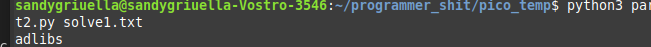

# C3
**Flag:** `picoCTF{adlibs}`

- We have the Code used to encrypt the original cipher text, spent long time on trying to understand what it was doing,

```
import sys
chars = ""
from fileinput import input
for line in input():
    # print(line)
    chars += line
# print(chars)

lookup1 = "\n \"#()*+/1:=[]abcdefghijklmnopqrstuvwxyz"
lookup2 = "ABCDEFGHIJKLMNOPQRSTabcdefghijklmnopqrst"

out = ""

prev = 0

for char in chars:
  # print(char)
  cur =  lookup2.index(char)
  nigga = (cur + prev) % 40
  out += lookup1[nigga]
  prev = nigga
    

sys.stdout.write(out)

```
The above code will Decrypt the given cipher text, save the file to `reverse_datshit.py` and run  `python3 reverse_datshit.py ciphertext > solve1.txt`


```
#asciiorder
#fortychars
#selfinput
#pythontwo

chars = ""
from fileinput import input
for line in input():
    chars += line
b = 1 / 1

for i in range(len(chars)):
    if i == b * b * b:
        print chars[i] #prints
        b += 1 / 1

```

- this is the decoded cipher text, the comments suggest it that it is python2 code but with trivial changes it can be converted to python3 code. 


```
#asciiorder
#fortychars
#selfinput
#pythontwo

chars = ""
from fileinput import input
for line in input():
    chars += line
b = 1 

for i in range(len(chars)):
    if i == b * b * b:
        print(chars[i], end='') #prints
        b += 1 
```
- beyond this i was a little confused as to what to give it input, 
- i then gave the code file itself (solve1.txt) as input and got the word `adlibs` i added  the `picoCTF` to it and voila !! it worked. 

- 


What you learned through solving this challenge:

1. Reverse Things in general specially the Modulo function 
2. Patience, (a lot of it !!)

Other incorrect methods you tried:

- Incorrectly Reversing the file over several Hours trying out different things
- not Reading the entire prompt and wondering what went wrong even when at the end i had succefully completed the problem, 


References

- https://stackoverflow.com/questions/10133194/reverse-modulus-operator sup sathvick
- https://www.geeksforgeeks.org/python-sys-module/ pretty cool if you actually read till here 

---

# Custom Encryption

**Flag:** `picoCTF{custom_d2cr0pt6d_dc499538}`

- This is an interesting challenge wherein we have to reverse a python file, and get the original string back from the original string, 
- The program although appearing complex is relatively very simple, its just generating some values which are already given to use (a,b) and using them to encrypt the text. 

- Use the following program to decrypt, 

```
flag =  [33588, 276168, 261240, 302292, 343344, 328416, 242580, 85836, 82104, 156744, 0, 309756, 78372, 18660, 253776, 0, 82104, 320952, 3732, 231384, 89568, 100764, 22392, 22392, 63444, 22392, 97032, 190332, 119424, 182868, 97032, 26124, 44784, 63444]


a = 89
b = 27

p = 97
g = 31


u = pow(g, a, p)
v = pow(g, b, p)

key = pow(v, a, p) # 12
b_key = pow(u, b, p) # 12

# reverse the encrypt function. DONE.  
def decrypt(plain_text, key):
    cipher = []
    for char in plain_text:
        cipher.append(chr(int(char / key / 311)))
    return cipher


# DONE.
def reverse_dynamic_xor_encrypt(xored_vaue, text_key="trudeau"):
    unciphered_text = ""
    key_length = 7
    for i, char in enumerate(xored_vaue):
        key_char  = text_key[i % key_length]
        derypted_char = chr(ord(char) ^ ord(key_char))
        unciphered_text += derypted_char
    
    return unciphered_text


foo = decrypt(flag, 12)
print(foo)
shoo = reverse_dynamic_xor_encrypt(foo)
print(f"fonal_strng = {shoo[::-1]}")

#first decrypt crptonite top 3 wen? 
# then xor thingy. 

```


What you learned through solving this challenge:

1. Reversing Engineering thought process, 
2. more patience


References

- https://www.w3schools.com/python/python_operators.asp
- https://stackoverflow.com/questions/26301495/how-to-reverse-operation-in-python


