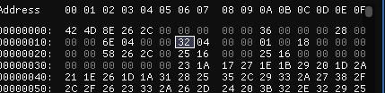
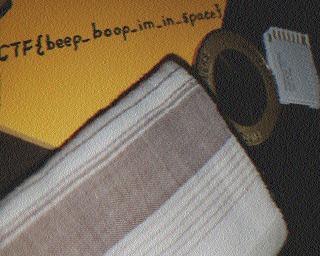

# Trivial Flag Transfer Protocol

**Flag:** `picoCTF{h1dd3n_1n_pLa1n_51GHT_18375919}`

The name of the challenge Implies that it has got something to do with  TFTP (trivial file transfer protocol):

- Download pcapng file and open it in wireShark, 
- We see several tftp reqs the first one has a string,
```
GSGCQBRFAGRAPELCGBHEGENSSVPFBJRZHFGQVFTHVFRBHESYNTGENAFSRE.SVTHERBHGNJNLGBUVQRGURSYNTNAQVJVYYPURPXONPXSBEGURCYNA
```
Decoding that with ceaser cipher with a shift of 13 gives

```
TFTPDOESNTENCRYPTOURTRAFFICSOWEMUSTDISGUISEOURFLAGTRANSFER.FIGUREOUTAWAYTOHIDETHEFLAGANDIWILLCHECKBACKFORTHEPLAN
```

Oh huh, assuming that there are more files we do a EXPORT-objects with tftp in wire-shark, 
this gives us all the files transfered with the network 
and we see the follwing files
 

- do a  `cat plan` and decode with ROT13 gives,   
```
IUSEDTHEPROGRAMANDHIDITWITH-DUEDILIGENCE.CHECKOUTTHEPHOTOS
```
The Emphasis on DueDiligence interesting ;),

- the program.deb is the deb file of a program called steghide, which is used to hide data inside images, 
- THe flag is probably hidden inside the images with steghide with pass... (DUEDILIGENCE)??

`steghide extract -sf ./picture1.bmp `
`steghide extract -sf ./picture2.bmp `
`steghide extract -sf ./picture3.bmp`

in the third file we get, 
```
steghide extract -sf ./picture3.bmp 
Enter passphrase: 
wrote extracted data to "flag.txt".
```

What you learned through solving this challenge:

1. Little Bit of WireShark
2. StegHide
3. small bits about tftp

Other incorrect methods you tried:

- Tried to search for the flag by `strings | grep pico` 
incorrectly assuming that the flag mightbe directly embedded in some request. 

References

- https://steghide.sourceforge.net/documentation/manpage.php
- https://www.geeksforgeeks.org/what-is-tftp-trivial-file-transfer-protocol/

---


# Challenge name

**Flag:** `picoCTF{qu1t3_a_v13w_2020}`

This was one the most tricky challenge, and required the knowledge of indepth information for the .bmp file format,

- We are given a file with no information on how to get the flag wth it, analysing the file with `file` command will give meaningful information, 
- we use exif tool which gives the following information 


We now know that most probably the file is a BMP (bit map) image. 

- Assuming that the header data must have been probably messed up we look at the file under a hex editor. 
- from the Refrence provided w.k.t that header must 54 bytes long (14 + 40) 
- the address at 0x0E which is the 15th and 16th byte of the file denote the size of info header which is 40 bytes long, which is `0x28` in hex. 


changing it to `28 00` we get image, 


- so looks like we are on the right path, but this is unfortunately not the flag. 

- analysing the header further we see that at the address `0A` specifies the total header length which as said sould be 54 or 0x36 in hex.

- Since the complete image is not visible we need to change width and or height to view the complete image, 

changing the values the look like the following in the hex editor



saving the image as a bmp and viewing it in any image editor we get the following image, 


1. Hex editors and Magick Numbers
2. How the file is interpreted in a image viewer
3. Reading and understanding image to get something

Other incorrect methods you tried:

- Converting the incomplete bmp to other formats to maybe get the image 
- randomly modifying hex data in hopes to achieve something, 

References

1. http://www.ece.ualberta.ca/~elliott/ee552/studentAppNotes/2003_w/misc/bmp_file_format/bmp_file_format.htm
2. https://grapherhelp.goldensoftware.com/subsys/subsys_bitmap_file_description.htm


# m00nwalk

**Flag:** `picoCTF{beep_boop_im_in_space}`

The m00nwalk challenge was an interesting one, it was a little out of the ordinary and i enjoyed solving this one, 

Hints given in the challenge say `How did pictures from the moon landing get sent back to Earth?` research on google say that sstv format was used. 
 

- Download the file and install program to decode the sstv audio file,
we will use, `https://github.com/colaclanth/sstv` 


- Download and install the program as prescribed on the page and use 
``` sstv -d message.wav -o result.png
```

- we get the following image which is the flag. 



- the second hint indicates towards the scottie mode, but the program we are using automatically detects it so we do not really need it. 


What you learned through solving this challenge:

1. moon landings?
2. Effectively googling things, 
3. Trying out different approaches if one way does not work, ( i found the flag to m00nwalk2 as well in the process,)

Other incorrect methods you tried:

- Tried to decode it though morse code. 
- Visualising the audio thinking it might reveal something

References

- https://en.wikipedia.org/wiki/Apollo_11_missing_tapes (sstv)
- https://github.com/colaclanth/sstv


