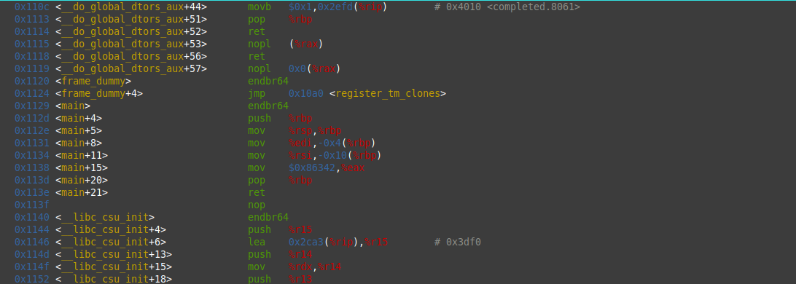

# GDB Baby Step 1

**Flag:** `picoCTF{549698}`

- At The End of the Function We can see in GDB that the value in hex 0x86342 is being transferred to 
eax register. 

- converting the value `0x86342` in decimal gives,  `549698`
- adding picoCTF{549698} to it gives the flag, 

What you learned through solving this challenge:

1. Little bit of assembly and GDB
2  how assembly is a topic of its own and needs a **LOT of time** 

Other incorrect methods you tried:

- Compiling and running the binary
- setting break point on `main` and trying to print the variable. 
- 

References

- (https://www.cs.umd.edu/~srhuang/teaching/cmsc212/gdb-tutorial-handout.pdf)
- 